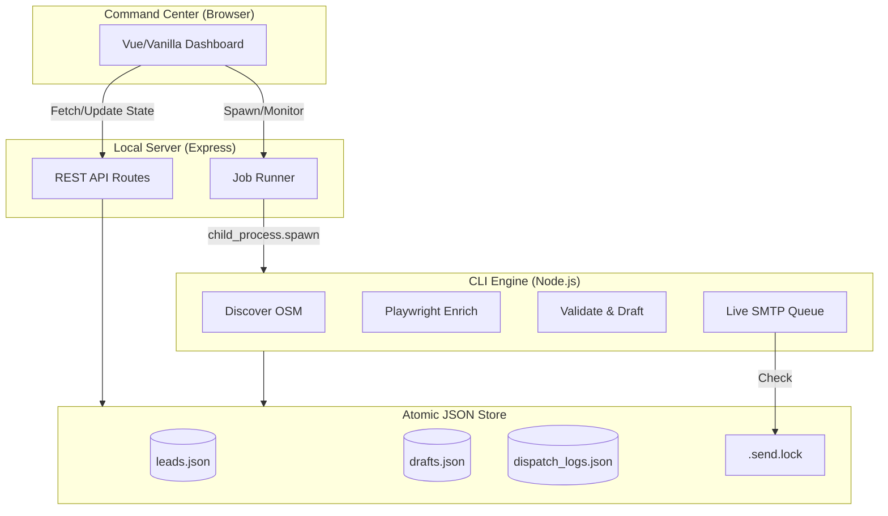

<div align="center">
  
  <h1>ClientVelo Engine</h1>
  <p><b>A local, zero-database B2B outreach Command Center and SaaS UI</b></p>

  [](https://opensource.org/licenses/MIT)
  [](#)
  [](#)
  [](#)
</div>

---

## 📖 Overview

**ClientVelo Engine** is an autonomous, offline-first B2B lead generation and outreach engine. It discovers local businesses via OpenStreetMap, enriches them with contact details, performs automated local mobile audits via Playwright, validates emails, and safely queues personalized outreach. 

Everything runs locally. There is no external database. The engine operates entirely on an atomic JSON-based data store with a beautiful "Command Center" dashboard serving as the control interface.

## ✨ Features

- **Command Center Dashboard:** A highly polished, Tailwind-powered local SaaS UI to monitor jobs, review drafts, and manage leads.
- **Playwright Enrichment & Audits:** Headless browsers automatically scrape up to 3 pages deep for contact info and take mobile screenshots to verify mobile responsiveness.
- **Zero-Database Atomic Store:** Relies entirely on robust, local JSON files (`data/leads.json`, etc.) with atomic writes. No database setup required.
- **Live Sending Orchestration:**
  - Strict **SHA256 batch fingerprinting** ensures what you approve is exactly what gets sent.
  - **File-based locking** (`.send.lock`) prevents concurrent send queues.
  - **Graceful Job Halting** via `.stop-send` cooperatives.
- **Manual Outreach & WhatsApp:** Generates one-click WhatsApp scripts for leads lacking an email address or marked as phone-only.
- **Built-in Email Validation:** Verifies syntax, catches role-based emails, and performs DNS MX record lookups to minimize bounces.

## 🏗️ Architecture Diagram



## 🚀 Getting Started

### Prerequisites
- [Node.js](https://nodejs.org/) v18+
- [Git](https://git-scm.com/)

### Installation

1. **Clone the repository:**
   ```bash
   git clone https://github.com/yourusername/ClientVelo.git
   cd ClientVelo/clientvelo-engine
   ```

2. **Install dependencies:**
   ```bash
   npm install
   ```

3. **Install Playwright browsers (for enrichment/audits):**
   ```bash
   npx playwright install chromium
   ```

4. **Configure environment:**
   ```bash
   cp .env.example .env
   # Edit .env with your SMTP credentials and OpenAI API keys.
   ```

## 🖥️ Usage Guide

### 1. Start the Command Center
Run the dashboard server to manage your workflow via the UI:
```bash
npm run cli serve --demo
```
Navigate to `http://localhost:3000` in your browser.


*(Upload a screenshot of your dashboard here)*

### 2. Discover Leads (CLI or UI)
You can trigger discovery from the UI Action Center, or directly via CLI:
```bash
npm run cli discover --niche "dentist" --city "Seattle" --limit 10
```

### 3. Review and Send
1. Use the **Review Workspace** in the UI to manually approve generated drafts (`A` to approve, `S` to skip).
2. Click **Live Send Approved** in the Action Center to safely dispatch emails. The system will enforce your daily cap and send window.

## 🛡️ Security & Disclaimers

**Local-Only Tool:** The Express server is strictly bound to `127.0.0.1`. It utilizes single-use session tokens (`X-CV-Token`) and spawns CLI tasks using strictly bounded `child_process.spawn` with `shell: false` to prevent injection. The UI does not evaluate dynamic HTML.

**Compliance Warning:** You are solely responsible for ensuring your outreach complies with local anti-spam legislation (e.g., CAN-SPAM, GDPR, CASL). Always honor opt-out requests immediately. This engine is intended strictly for B2B outreach.
